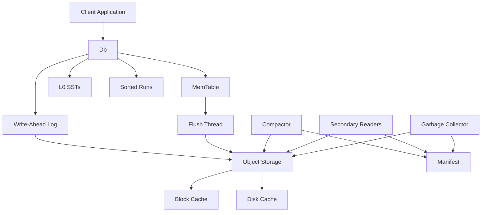

## Introduction

SlateDB is an embedded storage engine built as a [log-structured merge-tree](https://en.wikipedia.org/wiki/Log-structured_merge-tree) (LSM-tree). Unlike traditional LSM-tree storage engines like RocksDB or LevelDB, SlateDB writes data to object storage (S3, GCS, Azure Blob Storage, MinIO, Tigris, and others) instead of local disk.

This architectural decision allows SlateDB to provide:

- **Bottomless storage capacity** - No need to provision disk space
- **High durability** - Leverage the 11 9's durability of S3
- **Easy replication** - Built-in multi-region replication via object storage
- **Cloud-native scalability** - Separate compute from storage

The trade-off is higher latency and API costs compared to local disk operations.

## Core Components

SlateDB's architecture consists of several key components that work together:



### Database Core (slatedb/src/db.rs)

The `Db` struct is the main entry point for interacting with SlateDB. It manages:

- Active memtable for incoming writes
- Immutable memtables being flushed
- Database state (L0 SSTs and sorted runs)
- Write coordination and durability guarantees

Key implementation details from `slatedb/src/db.rs:86`:

```rust
pub(crate) struct DbInner {
    pub(crate) state: Arc<RwLock<DbState>>,
    pub(crate) settings: Settings,
    pub(crate) table_store: Arc<TableStore>,
    pub(crate) memtable_flush_notifier: UnboundedSender<MemtableFlushMsg>,
    pub(crate) write_notifier: UnboundedSender<WriteBatchMessage>,
    // ... additional fields
}
```

### Write Path

Writes flow through SlateDB in the following sequence:

1. **Client Write** → `put()` inserts key-value pair into active memtable
2. **WAL Write** → Memtable is periodically flushed to object storage WAL based on `flush_interval` configuration (slatedb/src/config.rs:589)
3. **L0 Flush** → When memtable reaches `l0_sst_size_bytes`, it's frozen and flushed to L0 as an SSTable
4. **Compaction** → L0 SSTs are merged into sorted runs to reduce read amplification

From `slatedb/src/db.rs:275`:

```rust
pub(crate) async fn write_with_options(
    &self,
    batch: WriteBatch,
    options: &WriteOptions,
) -> Result<WriteHandle, SlateDBError>
```

The `await_durable` option in `WriteOptions` (slatedb/src/config.rs:422) controls whether the write blocks until data is durably persisted to object storage.

### Read Path

Reads search through the database in LSM-tree order:

1. **Active Memtable** - Check the current mutable memtable
2. **Immutable Memtables** - Search frozen memtables awaiting flush
3. **L0 SSTs** - Scan level-0 SSTs in reverse-write order
4. **Sorted Runs** - Search compacted sorted runs in age order

From `slatedb/src/db.rs:192`:

```rust
pub(crate) async fn get_with_options<K: AsRef<[u8]>>(
    &self,
    key: K,
    options: &ReadOptions,
) -> Result<Option<Bytes>, SlateDBError>
```

The search terminates at the first location containing the key, ensuring the most recent value is returned.

## Single-Writer, Multi-Reader Model

SlateDB enforces a single-writer architecture as defined in CLEAN_SLATE.md:27:

> SlateDB only needs to support one writer process at a time. SlateDB should enforce this property.

This design choice simplifies concurrency control and is enforced through:

- **Writer Epochs** - Monotonically increasing epoch numbers fence zombie writers (rfcs/0001-manifest.md:436)
- **Manifest CAS Operations** - Compare-and-swap updates prevent write conflicts
- **Fencing Writes** - New writers fence older writers by writing empty SSTs with higher epochs

Multiple readers are fully supported and can run on separate machines, reading from consistent snapshots.

## Zero-Disk Architecture

From CLEAN_SLATE.md:26:

> SlateDB should be capable of running without any disks. Object storage is always the only source of truth.

This means:

- All durable data resides in object storage
- Local disk is used only for caching (optional)
- Recovery rebuilds state from object storage
- No need to manage disk capacity or replication

## State Management

SlateDB's state is managed through two key structures:

### DbState (slatedb/src/db_state.rs)

Holds the in-memory view of the database:

- Current memtable
- List of immutable memtables
- L0 SSTable metadata
- Sorted run metadata
- Next SST ID counter

### Manifest (rfcs/0001-manifest.md)

Persisted state stored in object storage as `.manifest` files:

- Writer and compactor epochs
- List of L0 SSTs
- Sorted run definitions
- Active snapshots for readers
- Last compacted WAL ID

The manifest uses sequential naming (`00000000000000000000.manifest`) and grows monotonically. The manifest with the highest ID is the current manifest.

## Object Storage Layout

SlateDB organizes files in object storage with this structure (rfcs/0001-manifest.md:212):

```
some-bucket/
├─ manifest/
│  ├─ 00000000000000000000.manifest
│  ├─ 00000000000000000001.manifest
│  ├─ 00000000000000000002.manifest
├─ wal/
│  ├─ 00000000000000000000.sst
│  ├─ 00000000000000000001.sst
│  ├─ ...
├─ compacted/
│  ├─ 01ARZ3NDEKTSV4RRFFQ69G5FAV.sst
│  ├─ 01BX5ZZKBKACTAV9WEVGEMMVRZ.sst
│  ├─ ...
```

- **manifest/** - Database state snapshots
- **wal/** - Write-ahead log SSTs (contiguous, sequentially numbered)
- **compacted/** - Compacted SSTs (ULID-named for uniqueness)

## Recovery and Durability

When a SlateDB process starts:

1. **Load Manifest** - Read the latest manifest from object storage
2. **Replay WAL** - Reconstruct memtable by replaying SSTs after `wal_id_last_compacted`
3. **Resume Operations** - Writer increments epoch and starts accepting writes

From slatedb/src/db.rs:505:

```rust
async fn replay_wal(&self) -> Result<(), SlateDBError>
```

WAL replay loads SSTs in batches (configured via `WalReplayOptions`) and rebuilds the memtable state.

## Performance Characteristics

### Write Amplification

From rfcs/0002-compaction.md:81:

> Write amplification is not much of a concern from a cost perspective. The major cloud providers don't charge for data transfers to/from the "standard" tier of object storage.

However, write amplification affects network bandwidth utilization. The compactor must balance throughput against available network capacity.

### Read Amplification

From rfcs/0002-compaction.md:83:

> Read amplification can be mitigated by effective caching. Ideally, for optimal performance and cost, reads can be served entirely from cache.

SlateDB uses several techniques to reduce read amplification:

- Bloom filters (configured via `filter_bits_per_key` in slatedb/src/config.rs:617)
- Block caching (in-memory and disk)
- SST metadata caching
- Compaction to reduce sorted run count

### Space Amplification

From rfcs/0002-compaction.md:85:

> SlateDB is not as sensitive to space amplification as disk-based databases because storage is practically unbound, and is cheap.

Object storage costs about 1/5th to 1/20th the cost of local disk depending on replication factor and storage tier.

## Next Steps

<CardGroup cols={2}>
  <Card title="LSM-Tree Structure" icon="sitemap" href="/concepts/lsm-tree">
    Learn about the LSM-tree data structure
  </Card>
  <Card title="Object Storage" icon="cloud" href="/concepts/object-storage">
    Understand object storage integration
  </Card>
  <Card title="Caching" icon="database" href="/concepts/caching">
    Explore caching strategies
  </Card>
  <Card title="Compaction" icon="compress" href="/concepts/compaction">
    Deep dive into compaction process
  </Card>
</CardGroup>