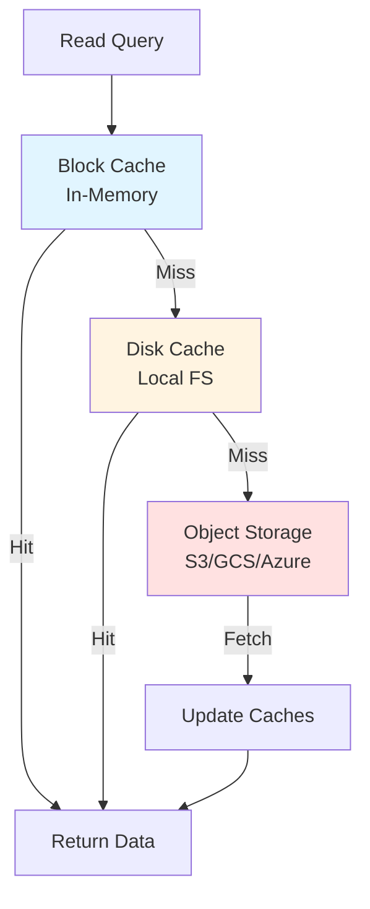

## Why Caching Matters

Object storage has higher latency than local disk:

- **Local SSD**: ~0.1ms read latency
- **S3 Standard**: ~50-100ms read latency
- **API cost**: $0.0004 per 1,000 GET requests

From README.md:21:

> To mitigate read latency and read API costs (GETs), SlateDB will use standard LSM-tree caching techniques: in-memory block caches, compression, bloom filters, and local SST disk caches.

Effective caching is crucial for both performance and cost.

## Cache Architecture

SlateDB implements a multi-tier caching strategy:



### Tier 1: In-Memory Block Cache

The fastest cache tier stores frequently accessed data in memory.

From slatedb/src/db_cache/mod.rs:38:

```rust
/// The default max capacity for the user default cache. (64MB)
pub const DEFAULT_MAX_CAPACITY: u64 = 64 * 1024 * 1024;
pub const DEFAULT_BLOCK_CACHE_CAPACITY: u64 = 512 * 1024 * 1024;
pub const DEFAULT_META_CACHE_CAPACITY: u64 = 128 * 1024 * 1024;
```

### Tier 2: Disk Cache

Local disk provides a secondary cache layer with much larger capacity.

From slatedb/src/config.rs:1363:

```rust
#[cfg(not(target_pointer_width = "32"))]
max_cache_size_bytes: Some(16 * 1024 * 1024 * 1024),  // 16 GiB default
```

### Tier 3: Object Storage

The source of truth - always consulted on cache misses.

## In-Memory Caching

### Cache Interface

From slatedb/src/db_cache/mod.rs:138:

```rust
#[async_trait]
pub trait DbCache: Send + Sync {
    async fn get_block(&self, key: &CachedKey) -> Result<Option<CachedEntry>, crate::Error>;
    async fn get_index(&self, key: &CachedKey) -> Result<Option<CachedEntry>, crate::Error>;
    async fn get_filter(&self, key: &CachedKey) -> Result<Option<CachedEntry>, crate::Error>;
    async fn get_stats(&self, key: &CachedKey) -> Result<Option<CachedEntry>, crate::Error>;
    async fn insert(&self, key: CachedKey, value: CachedEntry);
    async fn remove(&self, key: &CachedKey);
    fn entry_count(&self) -> u64;
}
```

SlateDB caches four types of data:

1. **Blocks** - 4 KiB data blocks from SSTs
2. **Indexes** - Block index metadata
3. **Filters** - Bloom filters for membership tests
4. **Stats** - SST statistics (min/max keys, counts)

### Cache Implementations

SlateDB supports pluggable cache implementations:

#### Foyer Cache (Default)

From slatedb/src/db_cache/mod.rs:29:

```rust
#[cfg(feature = "foyer")]
pub mod foyer;
```

Foyer provides:
- Hybrid memory/disk caching
- Admission control
- Efficient eviction policies

#### Moka Cache

From slatedb/src/db_cache/mod.rs:33:

```rust
#[cfg(feature = "moka")]
pub mod moka;
```

Moka offers:
- Pure in-memory caching
- High performance
- Simple configuration

### Cache Keys

From slatedb/src/db_cache/mod.rs:158:

```rust
pub struct CachedKey {
    pub(crate) scope_id: u64,
    pub(crate) sst_id: SsTableId,
    pub(crate) block_id: u64,
}
```

Cache keys include:
- **scope_id**: Prevents collisions between multiple `Db` instances
- **sst_id**: WAL SST ID or compacted SST ULID
- **block_id**: Block offset within SST

### Split Cache Configuration

SlateDB can use separate caches for blocks and metadata:

From slatedb/src/config.rs:979:

```rust
block_cache: {
    let block_cache = default_block_cache();
    let meta_cache = default_meta_cache();
    Some(Arc::new(
        SplitCache::new()
            .with_block_cache(block_cache)
            .with_meta_cache(meta_cache)
            .build(),
    ))
}
```

Benefits:
- Optimize each cache independently
- Prevent metadata from evicting hot blocks
- Better hit rates overall

## Disk Caching

### Object Store Cache

From slatedb/src/config.rs:1318:

```rust
/// Options for the object store cache. This cache is not enabled unless an explicit cache
/// root folder is set. The object store cache will split an object into align-sized parts
/// in the local, and save them into the local cache storage.
pub struct ObjectStoreCacheOptions {
    /// The root folder where the cache files are stored.
    pub root_folder: Option<std::path::PathBuf>,
    
    /// The limit of the cache size in bytes.
    pub max_cache_size_bytes: Option<usize>,
    
    /// The size of each part file.
    pub part_size_bytes: usize,
}
```

### Enabling Disk Cache

```rust
use slatedb::config::Settings;

let mut settings = Settings::default();
settings.object_store_cache_options.root_folder = Some("/tmp/slatedb-cache".into());
settings.object_store_cache_options.max_cache_size_bytes = Some(16 * 1024 * 1024 * 1024);

let db = Db::builder(path, object_store)
    .with_settings(settings)
    .build()
    .await?;
```

### Part-Based Caching

The disk cache splits SSTs into fixed-size parts.

From slatedb/src/config.rs:1335:

```rust
/// The size of each part file, the part size is expected to be aligned with 1kb,
/// its default value is 4mb.
part_size_bytes: 4 * 1024 * 1024,
```

Benefits:
- Partial SST caching
- Efficient eviction (by part, not whole SST)
- Better cache utilization

### Cache PUT Operations

From slatedb/src/config.rs:1339:

```rust
/// Whether to cache PUT operations to disk. When enabled, data written via PUT operations
/// will be cached locally for faster subsequent reads. Default is false.
pub cache_puts: bool,
```

Considerations:
- Increases write latency slightly
- Improves read latency for recently written data
- Useful for read-heavy workloads after writes

### Cache Preloading

From slatedb/src/config.rs:1343:

```rust
/// Whether to preload SST files into cache during database startup.
pub preload_disk_cache_on_startup: Option<PreloadLevel>,
```

From slatedb/src/config.rs:200:

```rust
pub enum PreloadLevel {
    /// Preload only L0 SSTs (most recently written files)
    L0Sst,
    /// Preload all SSTs (both L0 and compacted levels)
    AllSst,
}
```

Preloading warms the cache on startup for faster initial queries.

### Cache Scanning

From slatedb/src/config.rs:1347:

```rust
/// Interval to scan the cache directory to rebuild the in-memory map for evictor.
/// The default value is 1 hour.
pub scan_interval: Option<Duration>,
```

Periodic scanning:
- Rebuilds cache metadata
- Detects manually deleted files
- Updates eviction policies

## Bloom Filters

Bloom filters are a space-efficient probabilistic data structure that tests set membership.

### Configuration

From slatedb/src/config.rs:608:

```rust
/// Write SSTables with a bloom filter if the number of keys in the SSTable
/// is greater than or equal to this value.
pub min_filter_keys: u32,
```

Small SSTables don't benefit from bloom filters - the overhead exceeds the savings.

From slatedb/src/config.rs:617:

```rust
/// The number of bits to use per key for bloom filters. We recommend setting this
/// to the default value of 10, which yields a filter with an expected fpp of ~.0082
pub filter_bits_per_key: u32,
```

Default 10 bits per key:
- False positive rate: ~0.82%
- Memory cost: 1.25 bytes per key

### Why Bloom Filters Matter

From rfcs/0002-compaction.md:343:

> Impact to point lookup cost should be dramatically reduced by SlateDB's usage of bloom filters.

Without bloom filters:
- Must read SST to determine if key exists
- Expensive on object storage (50-100ms per GET)

With bloom filters:
- ~0.82% false positives (with 10 bits/key)
- 99.18% of negative lookups skip SST read
- Massive cost and latency savings

### Optimizing Bloom Filter Size

From rfcs/0002-compaction.md:345:

> Monkey describes a simple optimization we can adapt that reallocates bloom filter bits from lower levels to higher levels to dramatically decrease the false-positive-rate (fpr) of higher-level filters.

Higher levels:
- Contain more data
- Checked more frequently
- Benefit more from lower FPR

Lower levels:
- Smaller data volume
- Less frequently checked
- Can tolerate higher FPR

## Compression

From README.md:133:

```
- [x] Compression (#10)
```

SlateDB supports multiple compression codecs.

From slatedb/src/config.rs:1046:

```rust
pub enum CompressionCodec {
    #[cfg(feature = "snappy")]
    Snappy,
    #[cfg(feature = "zlib")]
    Zlib,
    #[cfg(feature = "lz4")]
    Lz4,
    #[cfg(feature = "zstd")]
    Zstd,
}
```

Compression provides:
- Reduced object storage costs
- Lower network transfer
- Potentially faster reads (less data to transfer)
- Higher CPU usage

From slatedb/src/config.rs:663:

```rust
/// The compression algorithm to use for SSTables.
pub compression_codec: Option<CompressionCodec>,
```

Default: No compression (optimizes for CPU usage).

## Cache Efficiency

### Block Size Tuning

From slatedb/src/config.rs:209:

```rust
pub enum SstBlockSize {
    Block1Kib,
    Block2Kib,
    Block4Kib,  // default
    Block8Kib,
    Block16Kib,
    Block32Kib,
    Block64Kib,
}
```

Trade-offs:

**Smaller blocks**:
- Lower read amplification for point lookups
- More metadata overhead
- Faster cache insertion
- Better for random access patterns

**Larger blocks**:
- Better compression ratios
- Fewer cache entries
- Better for sequential scans
- More wasted transfer for point lookups

### Read Options

From slatedb/src/config.rs:275:

```rust
pub struct ReadOptions {
    /// Whether or not fetched blocks should be cached
    pub cache_blocks: bool,
}
```

For one-time scans or cold data:

```rust
let options = ReadOptions {
    cache_blocks: false,
    ..Default::default()
};

let value = db.get_with_options(key, &options).await?;
```

Prevents cache pollution from infrequent queries.

### Scan Options

From slatedb/src/config.rs:327:

```rust
pub struct ScanOptions {
    /// The number of bytes to read ahead.
    pub read_ahead_bytes: usize,
    
    /// Whether or not fetched blocks should be cached
    pub cache_blocks: bool,
    
    /// The maximum number of concurrent tasks for fetching blocks.
    pub max_fetch_tasks: usize,
}
```

For range scans:

```rust
let options = ScanOptions {
    read_ahead_bytes: 1024 * 1024,  // 1 MiB
    cache_blocks: false,  // Don't pollute cache
    max_fetch_tasks: 4,   // Parallel fetches
    ..Default::default()
};

let mut iter = db.scan_with_options(range, &options).await?;
```

## Cache Metrics

From slatedb/src/db_cache/mod.rs:42:

```rust
/// Atomic counter to generate unique scope IDs for `DbCacheWrapper` instances.
static NEXT_CACHE_SCOPE_ID: AtomicU64 = AtomicU64::new(0);
```

SlateDB tracks cache statistics:

- Hit rate
- Miss rate
- Eviction count
- Memory usage

From lib.rs:46:

```rust
pub use db_cache::stats as db_cache_stats;
```

Monitoring cache metrics helps tune:
- Cache size
- Block size
- Bloom filter configuration
- Compression settings

## Memory Management

### Block Reference Counting

From slatedb/src/db.rs:777:

```rust
/// The `Bytes` object returned contains a slice of an entire
/// 4 KiB block. The block will be held in memory as long as the
/// caller holds a reference to the `Bytes` object.
```

Blocks use reference counting:
- Multiple queries can share the same cached block
- Block released when last reference dropped
- Prevents unnecessary cache evictions

### Cache Eviction Policies

Cache implementations use standard eviction policies:

- **LRU** (Least Recently Used) - Evict oldest access
- **LFU** (Least Frequently Used) - Evict least accessed
- **FIFO** (First In First Out) - Evict oldest insertion

Foyer and Moka use adaptive policies that balance recency and frequency.

### Backpressure on Cache Miss

From slatedb/src/db.rs:310:

```rust
pub(crate) async fn maybe_apply_backpressure(&self) -> Result<(), SlateDBError>
```

When cache thrashing occurs:
- Monitor cache hit rate
- Apply backpressure if too many misses
- Prevent overwhelming object storage with GETs

## Best Practices

### For Point Lookups

1. **Enable bloom filters**
   ```rust
   settings.min_filter_keys = 1000;
   settings.filter_bits_per_key = 10;
   ```

2. **Use adequate block cache**
   ```rust
   // At least 512 MiB for production
   let block_cache = FoyerCache::new_with_opts(FoyerCacheOptions {
       max_capacity: 512 * 1024 * 1024,
       ..Default::default()
   });
   ```

3. **Enable disk cache for hot data**
   ```rust
   settings.object_store_cache_options.root_folder = Some("/cache".into());
   settings.object_store_cache_options.max_cache_size_bytes = Some(16 * 1024 * 1024 * 1024);
   ```

### For Range Scans

1. **Increase read-ahead**
   ```rust
   let options = ScanOptions {
       read_ahead_bytes: 1024 * 1024,  // 1 MiB
       ..Default::default()
   };
   ```

2. **Don't cache scan blocks**
   ```rust
   let options = ScanOptions {
       cache_blocks: false,  // Avoid cache pollution
       ..Default::default()
   };
   ```

3. **Use parallel fetches**
   ```rust
   let options = ScanOptions {
       max_fetch_tasks: 4,
       ..Default::default()
   };
   ```

### For Cost Optimization

1. **Maximize cache hit rate** - Reduces GETs
2. **Larger L0 SSTs** - Fewer files to check
3. **Regular compaction** - Fewer sorted runs
4. **Compression** - Reduces storage and transfer costs

## Next Steps

<CardGroup cols={2}>
  <Card title="Compaction" icon="compress" href="/concepts/compaction">
    Understand compaction process
  </Card>
  <Card title="Object Storage" icon="cloud" href="/concepts/object-storage">
    Learn about object storage integration
  </Card>
  <Card title="LSM-Tree" icon="sitemap" href="/concepts/lsm-tree">
    Explore LSM-tree fundamentals
  </Card>
  <Card title="Architecture" icon="diagram-project" href="/concepts/architecture">
    See the full system architecture
  </Card>
</CardGroup>