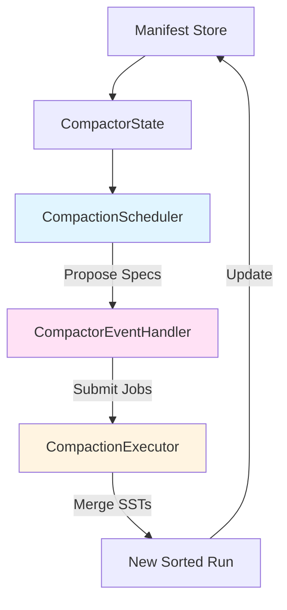

## What is Compaction?

Compaction is the process of merging multiple sorted tables into fewer, larger tables. From rfcs/0002-compaction.md:230:

> The compactor is responsible for taking groups of sorted runs and compacting them together to reduce space amplification (by removing old versions of rows that have been updated/deleted) and read amplification (by reducing the number of sorted runs that need to be searched on a read).

Without compaction:
- L0 grows unbounded
- Reads scan many overlapping SSTs
- Deleted keys persist indefinitely
- Space usage grows linearly

## The Compaction Problem

From rfcs/0002-compaction.md:51:

> There are a few problems with the current implementation that we address with this design:
> 1. As the DB grows, `get()` becomes very expensive because it has to search an ever-growing list of SSTs.
> 2. Similarly, as the DB grows, start becomes very slow because SlateDB has to reload the state of all the SSTs
> 3. The storage space used grows without bound even if the key space is finite.

Example scenario:
- Write same key 1000 times
- Without compaction: 1000 versions stored
- With compaction: Only latest version kept

## Compaction Architecture

SlateDB's compactor consists of four main components:



From slatedb/src/compactor.rs:100:

```rust
pub trait CompactionSchedulerSupplier: Send + Sync {
    fn compaction_scheduler(
        &self,
        options: &CompactorOptions,
    ) -> Box<dyn CompactionScheduler + Send + Sync>;
}
```

### CompactionScheduler

Decides what to compact and when.

From slatedb/src/compactor.rs:123:

```rust
pub trait CompactionScheduler: Send + Sync {
    fn propose(&self, state: &CompactorStateView) -> Vec<CompactionSpec>;
    fn validate(&self, state: &CompactorStateView, spec: &CompactionSpec) -> Result<(), Error>;
}
```

Responsibilities:
- Analyze current database state
- Select SSTs/sorted runs to merge
- Validate compaction proposals

### CompactionExecutor

Performs the actual compaction work.

From slatedb/src/compactor.rs:239:

> The Executor does the actual work of compacting sorted runs by sort-merging them into a new sorted run.

Implementation: `TokioCompactionExecutor` (slatedb/src/compactor_executor.rs)

### CompactorEventHandler

Orchestrates the compaction process.

From slatedb/src/compactor.rs:410:

```rust
pub(crate) struct CompactorEventHandler {
    state_writer: CompactorStateWriter,
    options: Arc<CompactorOptions>,
    scheduler: Arc<dyn CompactionScheduler + Send + Sync>,
    executor: Arc<dyn CompactionExecutor + Send + Sync>,
}
```

Responsibilities:
- Poll manifest for changes
- Request specs from scheduler
- Submit jobs to executor
- Update manifest with results

## Compaction Levels

SlateDB uses a tiered compaction strategy with multiple levels:

### WAL → L0 Compaction

The writer compacts WAL to L0. From rfcs/0002-compaction.md:91:

> The main writer compacts the WAL to the first level of the database. This has a number of benefits:
> - The main writer compacts the WAL directly from memory without reading the data back from S3 first.
> - This offloads some of the compaction i/o from the compactor onto the writer.

From rfcs/0002-compaction.md:173:

```rust
// write:
1. `put` adds the key-value to the current memtable
2. If the current memtable is larger than `l0_sst_size`, freeze the memtable
3. Write the memtable to a new ULID-named SST in `compacted`
4. Update the manifest with the new L0 SSTs
```

Configuration from slatedb/src/config.rs:621:

```rust
/// The minimum size a memtable needs to be before it is frozen and flushed to
/// L0 object storage.
pub l0_sst_size_bytes: usize,
```

### L0 → Sorted Runs

The compactor merges L0 SSTs into sorted runs.

From rfcs/0002-compaction.md:666:

```
1. List all SSTs in the `wal` folder > `wal_id_last_compacted`
2. Create a new merged SST in `leveled_ssts`'s level 0
3. Update the manifest with the new `leveled_ssts`, `wal_id_last_compacted`, and `wal_id_last_seen`
```

Key insight from rfcs/0002-compaction.md:671:

> This design implies that level 0 for `leveled_ssts` will not be range partitioned. Each SST in level 0 would be a full a-z range.

### Sorted Run Merging

Lower levels merge sorted runs together.

From rfcs/0002-compaction.md:210:

```rust
struct Compaction {
    id: u32,
    sources: Vec<SourceId>,  // SSTs or sorted runs to merge
    destination: u32,         // Destination sorted run ID
}
```

Sources must be logically consecutive:
- Adjacent L0 SSTs, or
- Adjacent sorted runs, or  
- Last L0 SST + first sorted run

## Size-Tiered Compaction

SlateDB uses size-tiered compaction as its primary strategy. From rfcs/0002-compaction.md:340:

> Initially we propose to implement basic tiered compaction, which tries to maintain sorted runs in size-based levels, and constrains the number of sorted runs in a given level by merging the runs together when there are too many of them.

### How It Works

From rfcs/0002-compaction.md:352:

```
1. Group SRs into levels L1, L2, ...
2. Size of runs in LN is at most: l0_sst_size × l0_compaction_threshold × level_compaction_threshold^N
3. Iterate levels from lowest to highest
4. Compact level N if:
   - Number of SRs in N > level_compaction_threshold_runs
   - Number of SRs in N+1 < level_max_runs
   - Number of uncompleted compactions < max_compactions
   - No ongoing compaction from level N
```

### Configuration

From slatedb/src/config.rs:1141:

```rust
pub struct SizeTieredCompactionSchedulerOptions {
    /// The minimum number of sources to include in a compaction.
    pub min_compaction_sources: usize,
    
    /// The maximum number of sources to include in a compaction.
    pub max_compaction_sources: usize,
    
    /// The size threshold for including a sorted run.
    pub include_size_threshold: f32,
}
```

Defaults:
- `min_compaction_sources: 4`
- `max_compaction_sources: 8`
- `include_size_threshold: 4.0`

From slatedb/src/config.rs:1082:

```rust
pub struct CompactorOptions {
    /// The interval at which the compactor checks for new manifest
    pub poll_interval: Duration,
    
    /// A compacted SSTable's maximum size (in bytes)
    pub max_sst_size: usize,
    
    /// The maximum number of concurrent compactions
    pub max_concurrent_compactions: usize,
}
```

### Why Size-Tiered?

From rfcs/0002-compaction.md:340:

> We choose tiered compaction because it works well for workloads with a moderate to high volume of writes because it has lower write amplification than leveled compaction.

Trade-offs:
- **Lower write amplification** - Less data rewritten per compaction
- **Higher read amplification** - More sorted runs to search
- **Higher space amplification** - More duplicate keys

From rfcs/0002-compaction.md:341:

> It still guarantees that the total number of runs is proportional to O(log(N)) where N is the size of the db.

## Compaction Process

### Step 1: Poll Manifest

From slatedb/src/compactor.rs:635:

```rust
async fn handle_ticker(&mut self) -> Result<(), SlateDBError> {
    if !self.is_executor_stopped() {
        self.state_writer.refresh().await?;
        self.maybe_schedule_compactions().await?;
        self.maybe_start_compactions().await?;
    }
    Ok(())
}
```

The compactor polls at `poll_interval` (default 5 seconds).

### Step 2: Propose Compactions

From slatedb/src/compactor.rs:742:

```rust
async fn maybe_schedule_compactions(&mut self) -> Result<(), SlateDBError> {
    let running_compaction_count = self.running_compaction_count();
    let available_capacity = self.options.max_concurrent_compactions - running_compaction_count;
    
    let mut specs = self.scheduler.propose(&self.state().into());
    // Add new compactions up to the max concurrency limit
}
```

Scheduler analyzes state and proposes compaction specs.

### Step 3: Validate & Submit

From slatedb/src/compactor.rs:678:

```rust
fn validate_compaction(&self, compaction: &CompactionSpec) -> Result<(), SlateDBError> {
    // Validate compaction sources exist
    if compaction.sources().is_empty() {
        return Err(SlateDBError::InvalidCompaction);
    }
    // Validate compaction sources exist in DB state
    // Validate L0-only compactions create new SR
    // Delegate to scheduler for policy-specific validation
}
```

Validation ensures:
- Sources exist in database
- Sources are consecutive
- Destination is valid
- No conflicts with running compactions

### Step 4: Execute Compaction

From slatedb/src/compactor.rs:863:

```rust
async fn start_compaction(
    &mut self,
    job_id: Ulid,
    compaction: Compaction,
) -> Result<(), SlateDBError> {
    let ssts = compaction.get_ssts(db_state);
    let sorted_runs = compaction.get_sorted_runs(db_state);
    
    let job_args = StartCompactionJobArgs {
        id: job_id,
        compaction_id: compaction.id(),
        destination: spec.destination(),
        ssts,
        sorted_runs,
        // ...
    };
    
    this_executor.start_compaction_job(job_args);
}
```

Executor:
1. Opens all source SSTs
2. Performs K-way merge sort
3. Applies retention/merge operators
4. Writes output SSTs
5. Reports progress

### Step 5: Merge Logic

From rfcs/0002-compaction.md:320:

> The Compaction Executor needs to coalesce updates. If the same key appears in multiple sources, then it takes the value from the logically latest (i.e. most recent) source.

Key resolution rules:
- **Duplicate keys** → Keep newest version
- **Tombstones** → Remove tombstone and older versions (if destination is SR 0)
- **TTL expiry** → Drop expired keys
- **Merge operands** → Apply merge operator

### Step 6: Update Manifest

From slatedb/src/compactor.rs:930:

```rust
async fn finish_compaction(
    &mut self,
    id: Ulid,
    output_sr: SortedRun,
) -> Result<(), SlateDBError> {
    self.state_mut().finish_compaction(id, output_sr);
    self.log_compaction_state();
    self.state_writer.write_state_safely().await?;
}
```

Manifest update:
- Remove source SSTs/SRs
- Add new sorted run
- Update `l0_last_compacted`
- Atomic CAS operation

## Sorted Run Structure

From rfcs/0002-compaction.md:96:

> A SR is made up of an ordered series of SSTs, each of which contains a distinct subset of the total keyspace. We use Sorted Runs instead of large SSTs because it is a simple way to keep the size of the metadata blocks small.

### Range Partitioning

Sorted runs are range-partitioned:

```
Sorted Run 1:
  SST A: [aaa, ddd)
  SST B: [ddd, ggg)
  SST C: [ggg, zzz]

Sorted Run 2:
  SST D: [aaa, mmm)
  SST E: [mmm, zzz]
```

Each SST within a run covers a disjoint key range.

### Sorted Run IDs

From rfcs/0002-compaction.md:130:

> The ID describes the SR's position in the list of sorted runs in `compacted`. That is, an SR S with an S.id must occur after SR S' with ID S'.id if S.id < S'.id.

Higher ID = newer run (appears first in search order).

## Backpressure

From rfcs/0002-compaction.md:364:

> The design described above applies back-pressure so that we don't wind up writing faster than we can compact and get unbounded read/space amplification.

From slatedb/src/config.rs:649:

```rust
/// Defines the max number of SSTs in l0. Memtables will not be flushed if there are more
/// l0 ssts than this value, until compaction can compact the ssts into compacted.
pub l0_max_ssts: usize,
```

When L0 is full:
1. Writes block memtable flushes
2. Backpressure applied to writers
3. Wait for compaction to free space

From slatedb/src/db.rs:310:

```rust
pub(crate) async fn maybe_apply_backpressure(&self) -> Result<(), SlateDBError>
```

## Tombstone Handling

From rfcs/0002-compaction.md:322:

> The Compaction Executor handles destination SR 0 specially. If the destination SR is 0, and the value for a key is resolved to a tombstone, then the Compaction Executor will not include the key in the resulting SR.

Tombstones are only removed when compacting to SR 0 (the final level), ensuring:
- No older versions exist
- Safe to permanently delete
- No resurrection of deleted keys

## Retention and TTL

Compaction applies time-based retention.

From slatedb/src/compactor.rs:890:

```rust
let job_args = StartCompactionJobArgs {
    // ...
    retention_min_seq: Some(db_state.recent_snapshot_min_seq),
    // ...
};
```

Keys are dropped if:
- TTL expired
- Sequence number below retention threshold
- Not referenced by active snapshots

## Merge Operators

From lib.rs:56:

```rust
pub use merge_operator::{MergeOperator, MergeOperatorError};
```

Merge operators allow applications to express partial updates.

Example from slatedb/src/compactor.rs:1076:

```rust
struct StringConcatMergeOperator;

impl MergeOperator for StringConcatMergeOperator {
    fn merge(
        &self,
        _key: &Bytes,
        existing_value: Option<Bytes>,
        value: Bytes,
    ) -> Result<Bytes, MergeOperatorError> {
        let mut result = existing_value.unwrap_or_default().as_ref().to_vec();
        result.extend_from_slice(&value);
        Ok(Bytes::from(result))
    }
}
```

During compaction:
- Merge operands are combined
- Final value computed
- Result written to output SST

## Compaction Metrics

From slatedb/src/compactor.rs:978:

```rust
pub const BYTES_COMPACTED: &str = "compactor.bytes_compacted";
pub const LAST_COMPACTION_TS_SEC: &str = "compactor.last_compaction_timestamp_sec";
pub const RUNNING_COMPACTIONS: &str = "compactor.running_compactions";
pub const TOTAL_BYTES_BEING_COMPACTED: &str = "compactor.total_bytes_being_compacted";
pub const TOTAL_THROUGHPUT_BYTES_PER_SEC: &str = "compactor.total_throughput_bytes_per_sec";
```

Metrics track:
- Bytes compacted
- Last compaction timestamp
- Running compaction count
- Total bytes being compacted
- Aggregate throughput

From slatedb/src/compactor.rs:535:

```rust
fn log_compaction_throughput(&self) {
    let throughput = if elapsed_secs > 0.0 {
        compaction.bytes_processed() as f64 / elapsed_secs
    } else {
        0.0
    };
}
```

## Advanced Topics

### Parallel Compaction

From slatedb/src/config.rs:1101:

```rust
/// The maximum number of concurrent compactions to execute at once
pub max_concurrent_compactions: usize,
```

Default: 4 concurrent compactions

Benefits:
- Higher aggregate throughput
- Better resource utilization
- Faster space reclamation

From rfcs/0002-compaction.md:326:

> One good option here is to use `async` Object Store APIs to concurrently read the various sources, and then to write the resulting SSTs while we move on to the next key ranges.

### Lazy Leveling

From rfcs/0002-compaction.md:399:

> Eventually, we can do leveled compaction to the final level (meaning, maintain a single run at the final level) to dramatically reduce space amplification as described in the dostoevsky paper.

Lazy leveling:
- Tiered compaction for upper levels
- Leveled compaction for final level
- Balances write amp vs space amp

### Distributed Compaction

From rfcs/0002-compaction.md:409:

> One of the main advantages of running in cloud is that applications can dynamically provision resources for a short time to burst capacity.

Future enhancement:
- Spawn large instances for expensive compactions
- Run compaction as separate service
- Scale compaction independently of writes

From rfcs/0002-compaction.md:413:

> It's worth calling out that we already get some of this benefit as most instances have burstable network.

## Best Practices

### For Write-Heavy Workloads

1. **Lower compaction threshold**
   ```rust
   let scheduler_options = SizeTieredCompactionSchedulerOptions {
       min_compaction_sources: 2,
       max_compaction_sources: 4,
       include_size_threshold: 2.0,
   };
   ```

2. **Increase max concurrent compactions**
   ```rust
   compactor_options.max_concurrent_compactions = 8;
   ```

3. **Smaller L0 SSTs**
   ```rust
   settings.l0_sst_size_bytes = 32 * 1024 * 1024;  // 32 MiB
   ```

### For Read-Heavy Workloads

1. **Higher compaction threshold**
   ```rust
   let scheduler_options = SizeTieredCompactionSchedulerOptions {
       min_compaction_sources: 8,
       max_compaction_sources: 16,
       include_size_threshold: 4.0,
   };
   ```

2. **Larger L0 SSTs**
   ```rust
   settings.l0_sst_size_bytes = 128 * 1024 * 1024;  // 128 MiB
   ```

3. **More aggressive compaction**
   ```rust
   compactor_options.poll_interval = Duration::from_secs(1);
   ```

### For Cost Optimization

1. **Larger SSTs** - Fewer objects, lower overhead
2. **Less frequent compaction** - Fewer writes
3. **Compression** - Smaller objects
4. **Smart backpressure** - Prevent runaway space usage

## Next Steps

<CardGroup cols={2}>
  <Card title="Caching" icon="database" href="/concepts/caching">
    Explore caching strategies
  </Card>
  <Card title="LSM-Tree" icon="sitemap" href="/concepts/lsm-tree">
    Understand LSM-tree structure
  </Card>
  <Card title="Object Storage" icon="cloud" href="/concepts/object-storage">
    Learn about object storage integration
  </Card>
  <Card title="Architecture" icon="diagram-project" href="/concepts/architecture">
    See the full system architecture
  </Card>
</CardGroup>