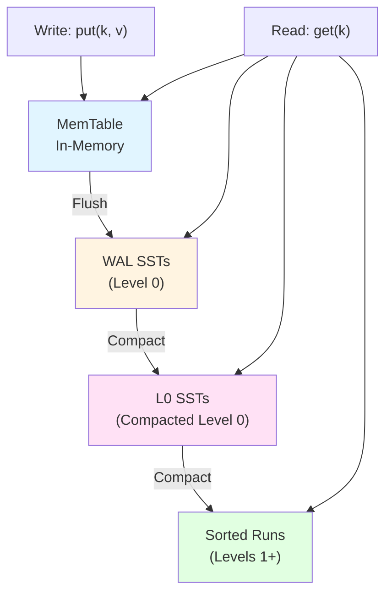

## What is an LSM-Tree?

A [Log-Structured Merge-Tree](https://en.wikipedia.org/wiki/Log-structured_merge-tree) (LSM-tree) is a data structure optimized for write-heavy workloads. It achieves high write throughput by:

1. **Buffering writes in memory** (memtable)
2. **Sequentially writing to disk/object storage** (immutable SSTables)
3. **Periodically merging sorted tables** (compaction)

SlateDB implements a cloud-native LSM-tree where "disk" is replaced with object storage.

## Core LSM-Tree Principles

### Write-Optimized Design

Traditional B-tree databases perform random writes, requiring expensive disk seeks. LSM-trees convert random writes into sequential writes:

1. Writes go to an in-memory buffer (memtable)
2. When full, the memtable is sorted and written sequentially
3. Multiple small sorted files are periodically merged

This approach is ideal for object storage, which excels at sequential PUT operations.

### Immutability

Once written, SSTables never change. Updates and deletes are handled by writing new versions:

- **Update**: Write a new entry with the same key and newer timestamp
- **Delete**: Write a tombstone marker for the key
- **Compaction**: Remove old versions and apply tombstones

From CLEAN_SLATE.md:26, SlateDB embraces immutability:

> Object storage is always the only source of truth.

## SlateDB's LSM-Tree Layout

SlateDB organizes data into multiple levels:



### MemTable

The active memtable is where all writes initially land. From slatedb/src/db.rs:53:

```rust
pub(crate) struct DbState {
    pub(crate) memtable: Arc<MemTable>,
    pub(crate) imm_memtables: Vec<Arc<MemTable>>,
    // ...
}
```

Key characteristics:

- **In-memory only** - Fastest write path
- **Sorted structure** - Enables efficient range queries
- **Size-bounded** - Frozen when reaching `l0_sst_size_bytes` (slatedb/src/config.rs:646)
- **Write-Ahead Log** - Protected by WAL for durability

### Write-Ahead Log (WAL)

The WAL in SlateDB differs from traditional LSMs. Instead of logging individual operations, it stores complete SSTs. From rfcs/0001-manifest.md:344:

> SlateDB uses SSTs for both the WAL and compacted files.

WAL SSTs are:

- **Sequentially numbered**: `00000000000000000000.sst`, `00000000000000000001.sst`, etc.
- **Contiguous**: No gaps in sequence numbers
- **Fenced by epochs**: Writer epochs prevent zombie writers (rfcs/0001-manifest.md:436)

From slatedb/src/config.rs:589:

```rust
/// How frequently to flush the write-ahead log to object storage.
pub flush_interval: Option<Duration>,
```

Configuration considerations:

- **Lower interval** → More PUT operations, higher cost, lower latency
- **Higher interval** → Fewer PUTs, lower cost, higher latency

### L0 SSTs (Level 0)

When memtables are flushed to object storage as L0 SSTs, they become the compacted level 0. From rfcs/0002-compaction.md:128:

```
table Manifest {
    l0_last_compacted: CompactedSstId
    l0: [SstId];
    compacted: Compacted;
}
```

L0 characteristics:

- **Full keyspace** - Each L0 SST spans the entire key range
- **Overlapping keys** - Multiple L0 SSTs may contain the same key
- **ULID-named** - Uses ULIDs for uniqueness: `01ARZ3NDEKTSV4RRFFQ69G5FAV.sst`
- **Read cost** - Must scan all L0 SSTs during reads

From slatedb/src/config.rs:649:

```rust
/// Defines the max number of SSTs in l0.
pub l0_max_ssts: usize,
```

When L0 reaches this limit, backpressure is applied to writers until compaction reduces the count.

### Sorted Runs (Levels 1+)

Sorted Runs represent compacted levels. From rfcs/0002-compaction.md:96:

> Each SR spans the full keyspace of the database. A SR is made up of an ordered series of SSTs, each of which contains a distinct subset of the total keyspace.

Sorted Run properties:

- **Range-partitioned** - Each SST covers a distinct key range
- **Ordered by age** - Newer runs appear before older runs
- **Point lookup optimization** - Search terminates at first run containing the key

From rfcs/0002-compaction.md:103:

```
table SortedRun {
    id: uint32;
    ssts:[SstId];
}
```

Each sorted run has a unique ID, and IDs are ordered by age (higher IDs = newer runs).

## Read Path

Reads follow LSM-tree order, searching from newest to oldest data:

### Point Lookups

From rfcs/0002-compaction.md:369:

```
memtable
immutable memtable
L0 SSTs, in order
SRs, in order
```

The search stops at the first match, ensuring the most recent value is returned.

### Range Scans

From rfcs/0002-compaction.md:377:

> To serve Range Scans, the reader needs to look through every memtable, immutable memtable, SST, and SR and sort-merge the key-values that fall within the range.

Range scans are more expensive because they must:

1. Read from all sources (memtable, L0, all sorted runs)
2. Merge-sort results
3. Apply deduplication (keep newest version per key)

## SSTable Format

SlateDB's SSTables store sorted key-value pairs in blocks. The format includes:

### Block Structure

From slatedb/src/config.rs:209:

```rust
pub enum SstBlockSize {
    Block1Kib,
    Block2Kib,
    Block4Kib,  // default
    Block8Kib,
    Block16Kib,
    Block32Kib,
    Block64Kib,
}
```

Blocks are the unit of caching and I/O. Smaller blocks reduce read amplification for point lookups but increase metadata overhead.

### Metadata

Each SST includes:

- **Block index** - Maps key ranges to block offsets
- **Bloom filter** - Probabilistic membership test (slatedb/src/config.rs:611)
- **Statistics** - Min/max keys, row counts, etc.

From rfcs/0001-manifest.md:86:

```rust
pub(crate) struct SsTableInfo {
    pub(crate) first_key: Bytes,
    pub(crate) block_meta: Vec<BlockMeta>,
    pub(crate) filter_offset: usize,
    pub(crate) filter_len: usize,
    pub(crate) block_meta_offset: usize,
}
```

### Bloom Filters

Bloom filters dramatically reduce unnecessary SST reads. From slatedb/src/config.rs:617:

```rust
/// The number of bits to use per key for bloom filters. We recommend setting this
/// to the default value of 10, which yields a filter with an expected fpp of ~.0082
pub filter_bits_per_key: u32,
```

Configuration trade-offs:

- **More bits** → Lower false positive rate, more memory
- **Fewer bits** → Higher false positive rate, less memory

From slatedb/src/config.rs:608:

```rust
/// Write SSTables with a bloom filter if the number of keys in the SSTable
/// is greater than or equal to this value.
pub min_filter_keys: u32,
```

Small SSTables skip bloom filters since the overhead may exceed the benefit.

## Versioning and Snapshots

### Multi-Version Concurrency Control (MVCC)

SlateDB uses sequence numbers for MVCC:

- Each write gets a unique, monotonically increasing sequence number
- Readers read at a specific sequence number (snapshot)
- Multiple versions of the same key can coexist

From rfcs/0001-manifest.md:393:

```proto
message Snapshot {
  uint128 id = 1;
  uint64 manifest_id = 2;
  uint32 snapshot_expire_time_s = 3;
}
```

### Snapshot Isolation

Readers can create snapshots for consistent reads. From CLEAN_SLATE.md:30:

> Snapshot isolation: Readers should be able to read from a consistent view of the database at a point in time.

Snapshots reference a specific manifest version, ensuring readers see a consistent database state even as writers continue modifying data.

## Tombstones and Deletions

Deletes in LSM-trees don't immediately remove data. Instead:

1. **Write tombstone** - Mark key as deleted
2. **Propagate through compaction** - Tombstone follows key through levels
3. **Remove during final compaction** - Tombstone dropped when no older versions exist

From rfcs/0002-compaction.md:322:

> If the destination SR is 0, and the value for a key is resolved to a tombstone, then the Compaction Executor will not include the key in the resulting SR.

Sorted Run 0 is special - it's the final level where tombstones can be safely removed.

## Parallelism and Concurrency

### Parallel Reads

Reads are naturally parallel:

- Multiple readers can query simultaneously
- Each reader operates on its snapshot
- No coordination needed between readers

### Sequential Writes

From CLEAN_SLATE.md:27:

> SlateDB only needs to support one writer process at a time.

The single-writer model simplifies:

- No write-write conflicts
- Simpler recovery logic
- Easier to reason about consistency

### Parallel Compaction

From rfcs/0002-compaction.md:157:

```rust
/// The maximum number of concurrent compactions to execute at once
pub max_concurrent_compactions: usize,
```

Compaction can run multiple jobs concurrently, limited by this configuration.

## Key Trade-offs

### Write Amplification vs Read Amplification

LSM-trees trade write amplification for better write throughput:

- **More compaction** → Better read performance, higher write amplification
- **Less compaction** → Better write throughput, worse read performance

SlateDB's tiered compaction balances these concerns (see [Compaction](/concepts/compaction)).

### Memory vs Disk/Network

From rfcs/0002-compaction.md:83:

> Read amplification can be mitigated by effective caching.

More cache memory reduces object storage API calls and latency.

### Space Amplification

From rfcs/0002-compaction.md:85:

> Our main concern with space amplification is that it grows the search space for reads.

Space amplification affects:

- Cache efficiency (more data to cache)
- Read cost (more sorted runs to search)
- Object storage cost (proportional to total data size)

## Next Steps

<CardGroup cols={2}>
  <Card title="Object Storage" icon="cloud" href="/concepts/object-storage">
    Learn about object storage integration
  </Card>
  <Card title="Compaction" icon="compress" href="/concepts/compaction">
    Understand compaction strategies
  </Card>
  <Card title="Caching" icon="database" href="/concepts/caching">
    Explore caching techniques
  </Card>
  <Card title="Architecture" icon="diagram-project" href="/concepts/architecture">
    See the full system architecture
  </Card>
</CardGroup>