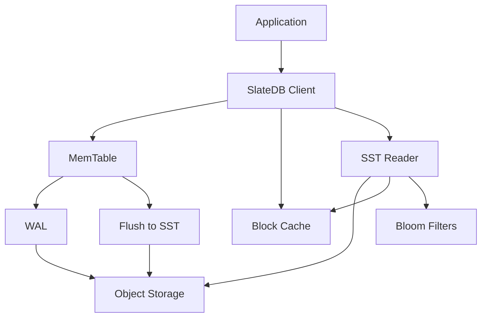

## What is SlateDB?

SlateDB is an embedded storage engine built as a [log-structured merge-tree](https://en.wikipedia.org/wiki/Log-structured_merge-tree) (LSM-tree). Unlike traditional LSM-tree storage engines that write to local disk, SlateDB writes data directly to object storage like S3, GCS, Azure Blob Storage, MinIO, Tigris, and more.

<Card title="Key Insight" icon="lightbulb">
  SlateDB treats object storage as a first-class citizen, not as a backup destination. This fundamental architectural choice unlocks unique benefits for cloud-native applications.
</Card>

## Why SlateDB?

SlateDB provides several compelling advantages for modern applications:

<CardGroup cols={2}>
  <Card title="Bottomless Storage" icon="database">
    Leverage the virtually unlimited capacity of object storage without managing disk provisioning or worrying about running out of space.
  </Card>
  <Card title="High Durability" icon="shield-check">
    Benefit from object storage's built-in replication and durability guarantees (typically 99.999999999% for services like S3).
  </Card>
  <Card title="Easy Replication" icon="copy">
    Clone databases instantly or replicate across regions by leveraging object storage primitives.
  </Card>
  <Card title="Cost Efficiency" icon="dollar-sign">
    Pay only for storage you use with object storage's competitive pricing, without overprovisioning local disks.
  </Card>
</CardGroup>

## How SlateDB Works

### Write Path

SlateDB optimizes for object storage's characteristics:

<Steps>
  <Step title="Batch Writes">
    To mitigate high write API costs (PUTs), SlateDB batches writes in memory. Rather than writing every `put()` call to object storage immediately, data accumulates in MemTables.
  </Step>
  <Step title="Periodic Flushes">
    MemTables are flushed periodically to object storage as string-sorted tables (SSTs). The flush interval is configurable based on your latency and cost requirements.
  </Step>
  <Step title="Durability Guarantees">
    By default, `put()` returns a `Future` that resolves when data is durably persisted to object storage. For lower latency at the cost of durability, use `put_with_options` with `await_durable` set to `false`.
  </Step>
</Steps>

### Read Path

To mitigate read latency and API costs (GETs), SlateDB employs standard LSM-tree caching techniques:

- **Block cache**: In-memory cache of frequently accessed data blocks
- **Bloom filters**: Probabilistic data structures to avoid unnecessary reads
- **Compression**: Reduce data transfer and storage costs
- **Disk cache**: Local SST caching for improved read performance

## Architecture Overview

SlateDB's architecture separates the write and read paths:

- **Write path**: Application → MemTable → WAL → Object Storage (periodic flush)
- **Read path**: Application → Block Cache → SST Reader → Object Storage

<Note>
  SlateDB is an **embedded** storage engine, meaning it runs in the same process as your application. There's no separate database server to deploy or manage.
</Note>

## Key Features

SlateDB supports a comprehensive set of features for modern applications:

### Core Operations
- ✅ Basic API (get, put, delete)
- ✅ Range queries with forward and reverse iteration
- ✅ Atomic batched writes
- ✅ Merge operators for custom value resolution

### Performance & Caching
- ✅ In-memory block cache
- ✅ Local disk cache for SSTs
- ✅ Compression (Snappy, LZ4, Zstd, Zlib)
- ✅ Bloom filters for efficient lookups

### Advanced Features
- ✅ Transactions with snapshot isolation
- ✅ Snapshots for consistent read-only views
- ✅ Checkpoints for point-in-time recovery
- ✅ Database cloning
- ✅ Change data capture (CDC)
- ✅ Automatic compaction with pluggable strategies

### Coming Soon
- 🔄 Range deletions
- 🔄 Database splitting and merging

## Language Support

SlateDB provides official bindings for multiple languages:

<CardGroup cols={2}>
  <Card title="Rust" icon="rust" href="/bindings/rust">
    Native implementation with full feature support
  </Card>
  <Card title="Python" icon="python" href="/bindings/python">
    PyO3-based bindings with sync and async APIs
  </Card>
  <Card title="Java" icon="java" href="/bindings/java">
    Java 24+ bindings using the Foreign Function & Memory API
  </Card>
  <Card title="Go" icon="golang" href="/bindings/go">
    CGo-based bindings for Go 1.25+
  </Card>
</CardGroup>

Community bindings are also available for .NET, Ruby, and TypeScript.

## Object Storage Support

SlateDB uses the [`object_store`](https://docs.rs/object_store/latest/object_store/) crate and supports any object storage implementing the `ObjectStore` trait:

- **AWS S3** and S3-compatible services (MinIO, Tigris, etc.)
- **Google Cloud Storage (GCS)**
- **Azure Blob Storage (ABS)**
- **Local filesystem** (for development and testing)
- **In-memory** (for testing)

<Tip>
  SlateDB re-exports the `object_store` crate, so you can use it directly without adding an extra dependency to your project.
</Tip>

## When to Use SlateDB

SlateDB is ideal for:

✅ **Cloud-native applications** that need durable embedded storage  
✅ **Serverless functions** requiring fast cold starts with shared state  
✅ **Edge computing** scenarios with sync to central object storage  
✅ **Data pipelines** that process and store results in object storage  
✅ **Applications** needing multi-region replication without operational overhead  

<Warning>
  SlateDB trades some write latency for the benefits of object storage. If you need microsecond write latencies, a local disk-based solution may be more appropriate.
</Warning>

## Trade-offs

Object storage provides significant benefits but comes with trade-offs:

**Advantages:**
- Higher durability (11 9's)
- Unlimited capacity
- Built-in replication
- Lower operational overhead
- Pay-per-use pricing

**Considerations:**
- Higher latency compared to local disk
- Higher API costs per operation
- Network dependency

<Note>
  SlateDB's design carefully mitigates object storage limitations through batching, caching, and bloom filters.
</Note>

## Getting Started

Ready to build with SlateDB? Here's what's next:

<CardGroup cols={2}>
  <Card title="Installation" icon="download" href="/installation">
    Install SlateDB for your language and platform
  </Card>
  <Card title="Quickstart" icon="rocket" href="/quickstart">
    Build your first SlateDB application in minutes
  </Card>
</CardGroup>

## Community & Support

Join the SlateDB community:

- **GitHub**: [github.com/slatedb/slatedb](https://github.com/slatedb/slatedb)
- **Discord**: [discord.gg/mHYmGy5MgA](https://discord.gg/mHYmGy5MgA)
- **Website**: [slatedb.io](https://slatedb.io)
- **Docs**: [docs.rs/slatedb](https://docs.rs/slatedb/latest/slatedb/)

## Foundation

SlateDB is a member of the [Commonhaus Foundation](https://www.commonhaus.org/), ensuring open governance and long-term sustainability.

## License

SlateDB is licensed under the Apache License, Version 2.0.
